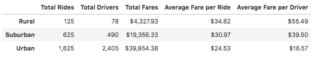
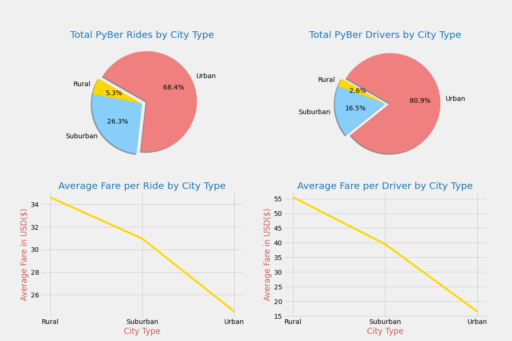
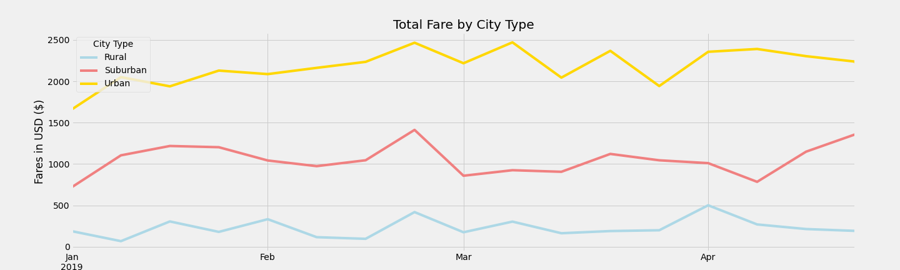
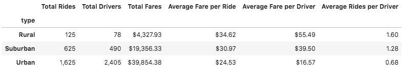
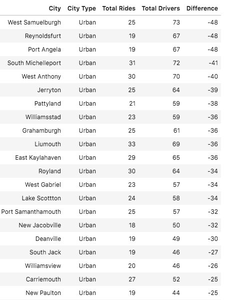

# PyBer Rideship by City Type Analysis

## Overview

The executives at PyBer, the industry leader in the rideshare sector, are interested in understanding more about the PyBer performance and activity in different city types: Urban, Suburban, and Rural.  By examining key metrics like average number of trips, number of drivers, and total weekly fares by city type, executives of PyBer will be better prepared to make strategic decisions to improve performance in each of these geographies.

While many of the results were not surprising, there is a very interesting finding that was unexpected!

## Resources 
This analysis utilizes **Python** and its many wonderful modules and library of imports including **pandas** and **matplotlib**.  The coding was done in Jupyter Lab.

The source data includes 2 csv files from PyBer:

1. city_data.csv: *data on 120 cities including number of drivers per city and city type identifier*
2. ride_data.csv: *data on rides from 01/01/2019 through 05/08/2019: 127 days*

Both files can be found in this repository in the Resources folder. 


## Results
In order to understand what is happening in these 3 different geography types: Urban, Suburban, and Rural, the ride data needs to be merged with the city data.  This was done on their common element "city".

From there, a series of ```groupby``` statements were written to get various totals and averages for each city type by grouping on ```type```.



**Item to note:**  In order to not exaggerate the Total Driver by city count, the city data was used for Total Drivers, not the merged dataframe.  All other ```groupby``` statements were perfomed using the merged dataset ```pyber_data_df```.

Most of the results are **not too surprising**:  

* **Total Rides** increases as the population density increases; the more people, the more rides booked (i.e. demand). Additionally, in the Urban areas, fewer people have cars requiring more rideshare services; and typically, more tourism occurs in Urban areas also allowing for higher demand of rideshare services. No surprise: **Urban** cities represent the majority of Total Rides: **68.4%**.
* **Total Drivers** also increases as the population density and demand increase. Similarly, the largest portion of PyBer drivers will be in the **Urban** areas: **80.9%**.
* **Average Fare per Ride** decreases in the more densely populated, condensed areas where rides are typically shorter in duration. Conversely, rides in the less populated, sprawled areas (i.e. Rural and Suburban) will be longer distances resulting in more expensive rides.
* **Average Fare per Driver** also decreases as the city type reflects more densely populated areas: i.e. shorter trips.  However, the drop off for the Urban average fares per driver appears to be exaggerated based on the extremely large number of drivers.



Looking at the **Total Fares by City Type** charted below, again nothing too surprising here.  The Urban areas, where rideshare has the highest demand is consistently higher than Suburban, which is consistently higher than Rural.  Urban cities have more residents and tourists without cars needing alternative transportation.  Even if the average fare per ride is lower, the demand and number of rides booked is higher, causing the total fares booked to be higher.



What **is surprising** is the **Total Rides versus Total Drivers**.  Adding a new statistic,  **Average Rides per Driver**, we can see that across the board, but especially in the Urban areas, there are more available drivers than demand for rides.  In the 4 plus months this data spans, the Rural areas see an average of 1.6 rides per driver, Suburban cities see 1.28 rides per driver, and ***Urban cities see less than 1 ride per driver***.  Clearly, PyBer has more drivers than it needs, so let's dig a little deeper.



An unfortunate **limitation of this data** is that there is no driver identification associated with the ```ride_id```; the only driver datapoint is number of drivers per city. Tracking which specific drivers have 0 rides, or are "inactive", cannot be determined from this data.

However, we can identify what cities have more drivers than total rides booked for this time period.  By using a ```groupby``` statement on the original ride data, we can count the number of rides per city.  By merging those results with the city data, we can pick up the number of drivers in each city (which is original to the city dataset). Subtract the two and output the cities that have "too many drivers" (i.e. more drivers than rides).

**Sixty-five (65) of the 120 cities** represented in this data report more drivers than rides booked for this time period. For these 65 cities, there is a total of **2,473 PyBer drivers** across all 3 city types, but **only 1,380 rides were booked** - a difference of 1,093.  

Here are the top 20 cities:  



Again, not surprising, the top 20 cities are all Urban.

## Summary and Recommendations

It is fairly obvious that the Urban areas, where there is vastly more demand for rideshare services, will yield the highest number of rides, have the highest number of drivers and the most revenue in total fares.  From this sample data, it is also clear that:

1. There are fewer rides booked in the Rural and Suburban areas.
2. The Fare ($) per ride is lowest in Urban cities where trips tend to be shorter in distance, and increases as the geography becomes more sprawled and less densely populated.

Therefore, **one recommendation** for PyBer executives is explore strategies targeting to **increasing and create new demand in the Suburban (and even Rural) areas** where the average fare is higher per ride. This data shows that all the Suburban cities combined (36 cities) booked only 625 rides over 127 days or approximately 5 rides per day or 14% of the cities booking rides.  The Rural areas are booking less than 1 ride per day (125 rides over 127 days in 18 cities).  There is certainly room from growth, but how much? Further investigation is needed.  

The most interesting finding is that PyBer is "holding" too many drivers, particularly in the Urban cities, where the PyBer's supply of drivers is much higher than the demand for their service.  

These inflated driver counts are decreasing the Average Fare per Driver and the Average Number of Rides per Driver: key metrics in promoting and understanding the success of the business and recruiting new drivers. Additionally, there is a cost associated with onboarding, background checking, and maintaining these contract drivers.  

Therefore, it is also our **recommendation** to:

1. Capture additional datapoints to link specific drivers with each ```ride_id``` so this analysis can go deeper to identify "inactive" drivers.
2. Re-calculate these key metrics based on "active" drivers that have at least 1 ride per a specified time period.  When we apply a **rough** estimate of removing 1,093 drivers from this data (based on the above findings):
	*  the average fare per driver during this time period jumps from **$21.37 to $58.13** (*more than double*),
	*  the average number of rides booked per driver during this time period jumps from: **0.80 to 2.17** rides: (*almost 3X*)
3. Review, establish, enforce policies on requiring a ceratin number of rides booked per specified time period in order to keep in good standing as a PyBer Driver.

4. Establish and enforce onboarding or recruiting policies that prevent overhiring of drivers. 

Our **final recommendation** can be given to most CEOs, the more data collecting, wrangling, and analyzing, the better prepared company leaders are to strategically drive growth and improvement. 